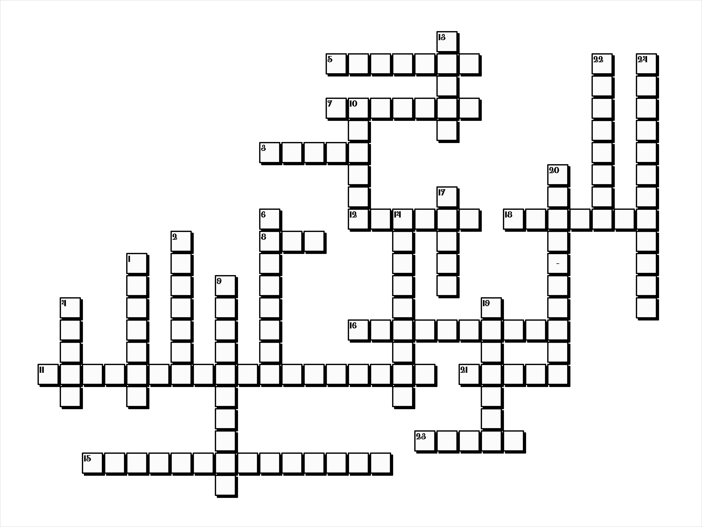

# Crossword Generator

## Introduction

The Crossword Generator is an R-based tool designed to automate the creation of crossword puzzles from given word lists. This project aims to provide educators, puzzle enthusiasts, and researchers with a customizable and efficient way to generate crosswords for educational purposes, leisure, and cognitive research.

## Features

- **Customizable Grid Sizes**: Adjust the crossword grid size according to your needs.
- **Multiple Language Support**: Generate crosswords in different languages, starting with English and Russian examples.
- **Automated Clue Generation**: Automatically pairs words with clues from a provided database.
- **Visual and Text Output**: Generates crossword puzzles in both visual (PNG) and text formats for easy printing and sharing.

## Getting Started

### Prerequisites

Before you begin, ensure you have R installed on your machine (version 3.6 or later recommended). You will also need to install the following R packages: `hash`, `words`, `png`, `igraph`, `concaveman`.

> install.packages(c("hash", "words", "png", "igraph", "concaveman"))

### Installation

Clone the repository to your local machine to get started with the Crossword Generator:

> git clone https://github.com/YourUsername/crossword.git


Navigate to the project directory and install any additional dependencies as needed.

## How to Use

### Typical Usage Scenario

1. **Preparing Your Input Files**: Place your word list in the `input/text` directory. The file should have one word-clue pair per line, separated by a comma.

2. **Running the Script**: Execute the `crossword_generator.R` script, specifying your input file as an argument. For example:

    ```
    Rscript crossword_generator.R input/text/2023-Dec_Xmas-Card-Xword.txt
    ```

    This will generate the crossword puzzle and save the output in both textual and graphical formats in the `output` directory.

3. **Viewing the Output**: Check the `output/img` directory for PNG images of your crossword puzzle and the `output/txt` directory for text files containing the puzzle clues and answers.

### Example Output

Showcase an example of the generated crossword puzzle:



*Generated crossword puzzle from the example input file.*

## Contributing

Contributions to the Crossword Generator are welcome! If you have suggestions for improvements or new features, please feel free to fork the repository and submit a pull request.

## License

This project is licensed under the MIT License - see the [LICENSE.md](LICENSE) file for details.

## Acknowledgments

- Mention any collaborators, datasets, or third-party images and code used in the project.
