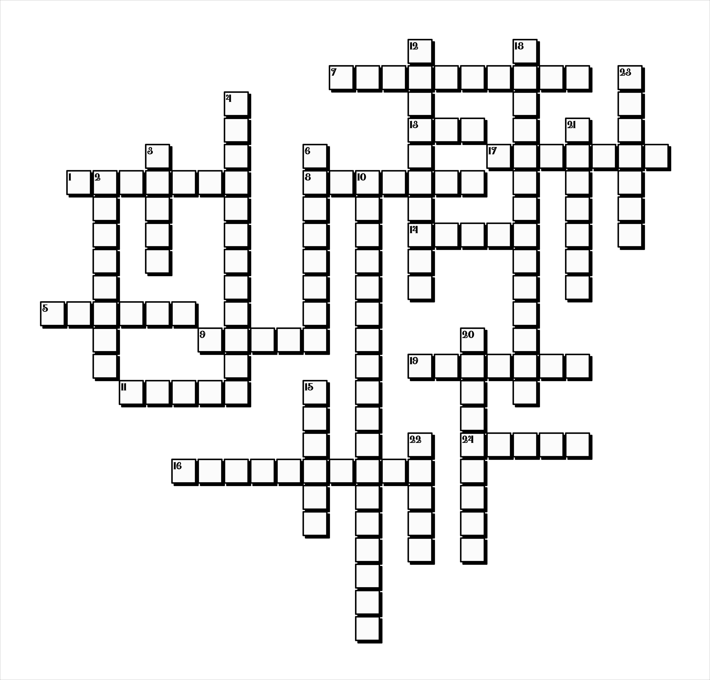

# Crossword Generator

## Introduction

This Crossword Generator is an R-based tool designed to automate the creation of crossword puzzles from provided paired word + clue lists. I wrote this for making holiday cards, like this one from 2023:


But I can imagine it being more broadly useful to educators, puzzle enthusiasts, and others for generating custom crosswords, especially insofar as it is a bit more flexible than conventional crossword generators.

The primary workflow leverages Markov Chain Monte Carlo to explore the space of possible crosswords, subject to constraints, with target mass constructed from a combination of graph-theoretic and user-specified properties.

## Features

- **Customizable Crossword Desiderata**: Adjust the desired crossword features according to your needs, including how much weight to give various components of the target mass, including:
  - **Area**: The total area of the crossword puzzle. Smaller areas are preferred to make the crossword more compact.
  - **Area Ratio**: Deviation from the desired dimensional ratio of the crossword, aiming for a specific ratio between the height and width of the puzzle.
  - **Horizontal vs. Vertical Word Ratio**: Balance between horizontal and vertical words, aiming for an equal number of horizontal and vertical words.
  - **Connectivity**: How interconnected the words are within the crossword. More connections are preferred to generate interdependent words and multiple paths towards generating partial solutions.
  - **Cycles**: The number of 4 & 6 length cycles within the crossword. More cycles are preferred to generate niftier shapes and assist with solving difficult clues.
  - **Circularity**: How circular the overall shape of the crossword is, determined by the variance of distances from the center to the concave hull containing the crossword.
  - **Picture Similarity**: Compares the crossword to a user-supplied picture, aiming for higher similarity. This penalty allows custom crosswords to resemble a given image, adding a degree of customization I couldn't in other crossword generators.

- **Multiple Language Support**: Generate crosswords in different languages, starting with English and Russian examples.

- **Pleasing and Varied Output**: Generate blank crosswords, filled in crosswords, and shapes to feed into generative image preprocessors, alongside text-based ordered lists of clues. Alternatively, export the crossword array and data for your own graphing in separate software. I also made the default drawn crossword to have a little drop-shadow effect that I thought looked nice.

## Getting Started

### Prerequisites

Before you begin, ensure you have R installed on your machine (version 3.6 or later recommended). You will also need to install the following R packages: `hash`, `words`, `png`, `igraph`, `concaveman`.

> install.packages(c("hash", "words", "png", "igraph", "concaveman"))

### Installation

Clone the repository to your local machine to get started with the Crossword Generator:

> git clone https://github.com/NikVetr/crossword.git

Navigate to the project directory and install any additional dependencies as described above.

## How to Use

### Typical Usage Scenario

1. **Preparing Your Input Files**: Place your word list in the `input/text` directory. The file should have one word-clue pair per line, separated by a colon (:), see example in `input/text`. Place any target images in `input/img`. By default, darker pixels will correspond to the space that the crossword aims to fill in, and white or transparent pixels to the space to be avoided.

2. **Running the Script**: Execute the `crossword_generator.R` script, specifying your input file in the script. For example, modifying the line:

    ```
    words_and_clues <- readLines("input/text/2023-Dec_Xmas-Card-Xword.txt", warn = F)
    ...
    pic <- png::readPNG("input/img/red_heart.png")
    ```

With paths to your own files. This will generate the crossword puzzle and save the output in both textual and graphical formats in the `output` directory.

3. **Viewing the Output**: Check the `output/img` directory for PNG images of your crossword puzzle and the `output/txt` directory for text files containing the puzzle clues and answers.

### Example Output

Using the word-clue list in `input/txt/2023-Dec_Xmas-Card-Xword_Russian.txt` and the target shape in `input/img/red_heart.png`:


I was able to produce the approximately heart-shaped crossword seen in the card above:



With paired file in `output/txt/`, which I then manually manipulated in Photoshop. Admittedly, lots of the generated output were duds! But then it's just a matter of running the program for half an hour and picking whatever output is most pleasing. Also included at the end of `crossword_generator.R` is code to refine a specific crossword, ie use some desired crossword to initialize MCMC vs. using random initialization, which may help with iterating over specific designs.

## Contributing

Contributions to the Crossword Generator are welcome! If you have suggestions for improvements or new features, please feel free to fork the repository and submit a pull request.

## Acknowledgments

- Thanks to Kate for helping me come up with words and clues, as well as for helping me visually inspect the output to identify the best candidates to refine and use.
